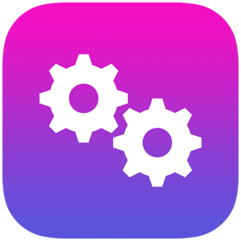

[](https://github.com/petarov/apple-mdm-clients/actions/workflows/build.yml)
[](https://github.com/petarov/apple-mdm-clients/actions/workflows/dependabot/dependabot-updates)
[](https://github.com/petarov/apple-mdm-clients/actions)
[](https://sonarcloud.io/summary/new_code?id=petarov_apple-mdm-clients)
[](https://github.com/petarov/apple-mdm-clients/blob/main/LICENSE)

# Apple MDM clients for Java

Java clients for Apple's Mobile Device Management (MDM) services.

`Java 21` required, with the goal to use as few external dependencies as possible.

## Device Assignment client

Manage your organization's Apple Business Manager (`ABM`) devices. Automated Device Enrollment `(ADE)`, previously known 
as "The Device Enrollment Program" `(DEP)` allows for creating device enrollment profiles and assigning them to your 
organization's devices.

To use the Java client, it is required that you already have created a valid device assignment token on ABM.
The private key with which the token must be decrypted is also required.

### Getting the library

**Releases**:

    implementation 'net.vexelon.mdm:device-assignment-client:0.0.1'

or

```xml
<dependency>
    <groupId>net.vexelon.mdm</groupId>
    <artifactId>device-assignment-client</artifactId>
    <version>0.0.1</version>
</dependency>
```

**Snapshots**: 

 - Latest [SNAPSHOT](https://github.com/petarov/apple-mdm-clients/packages/2517819) built from the `main` branch. This requires an [authenticated](https://docs.github.com/en/packages/working-with-a-github-packages-registry/working-with-the-apache-maven-registry) GitHub user.

### Example 

```java
var builder = DeviceAssignmentClient.newBuilder();
builder.setUserAgent("my-mdm-app-dep-v1");
builder.setServerToken(DeviceAssignmentServerToken.create(
		Path.of("<path-to-token>/token_file_smime.p7m"), 
		DeviceAssignmentPrivateKey.createFromDER(
				Path.of("<path-to-private-key>/private.der"))

var client = builder.build();
		
// Display account information
System.out.println(client.fetchAccount());

// Create a new profile and assign 2 device serial numbers to it
var response = client.createProfile(new Profile.ProfileBuilder()
    .setProfileName("mdm-server-01-sales-profile")
    .setUrl("https://mdm-server-01.local")
    .setDepartment("Sales")
    .setAwaitDeviceConfigured(true)
    .setMdmRemovable(true)
    .setSupportPhoneNumber("555-555-555")
    .setSupportEmailAddress("sales-it@example.org")
    .setDevices(Set.of("A9C1R3Q8KJA9", "B112R4L8KJC7"))
    .setSkipSetupItems(EnumSet.of(ProfileSkipItem.ENABLE_LOCKDOWN_MODE, 
        ProfileSkipItem.TAP_TO_SETUP, ProfileSkipItem.ICLOUD_DIAGNOSTICS, 
        ProfileSkipItem.ICLOUD_STORAGE)).build());
System.out.println(response.profileUuid());
```

See the complete list of service API calls on Apple's [Device Assignment](https://developer.apple.com/documentation/devicemanagement/device-assignment) web page.

## Legacy App and Book Management client

Manage apps and books for students and employees. This API is still perfectly functional, however, it has been 
deprecated by Apple, and it's no longer maintained.

### Getting the library

**Releases**:

    implementation 'net.vexelon.mdm:legacy-app-and-book-management-client:0.0.1'

or

```xml
<dependency>
    <groupId>net.vexelon.mdm</groupId>
    <artifactId>legacy-app-and-book-management-client</artifactId>
    <version>0.0.1</version>
</dependency>
```

**Snapshots**: 

 - Latest [SNAPSHOT](https://github.com/petarov/apple-mdm-clients/packages/2517820) built from the `main` branch. This requires an [authenticated](https://docs.github.com/en/packages/working-with-a-github-packages-registry/working-with-the-apache-maven-registry) GitHub user.

### Example 

```java
var builder = LegacyAppAndBookClient.newBuilder();
builder.setUserAgent("my-mdm-app-vpp-v1");
builder.setServerToken(LegacyAppAndBookToken.create(
        Path.of("<path-to-token>/sToken_for_your_company.vpptoken")));

var client = builder.build();
		
// Display all assets assigned to this token in ABM
System.out.println(client.client.fetchAssets(false));

// Retire a user by its unique id
System.out.println(client.retireUser(UserIdParam.of("MTY6MzAgZXN0YXIgbm8gbG9jYWwgZGV0ZXJtaW5hZG8=")));
```

# Proxy support

Only HTTP tunneling i.e. [HTTP CONNECT](https://developer.mozilla.org/en-US/docs/Web/HTTP/Reference/Methods/CONNECT) type of proxy servers connections are supported.
To enable proxy support just add the proxy options to the client builder.

```java
builder.setProxyOptions(MdmClientProxyOptions.ofHttp("proxy-host", 3128));
builder.setProxyOptions(MdmClientProxyOptions.ofHttp("proxy-host", 3128, "user", "pass"));
```

# Logging

The libraries use SLF4J, so you can plug debug and trace logs into your own logger. Here is a simple `log4j2.xml` example:

```xml
<logger name="net.vexelon.mdm" level="debug" additivity="false">
    <AppenderRef ref="console"/>
</logger>
```  

# Build

Requires [JDK 21](https://adoptium.net/temurin/releases/) or later

    ./gradlew clean build

# License

[MIT License](LICENSE)

