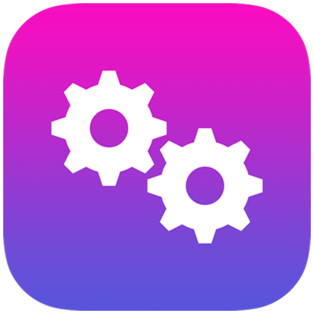

[](https://github.com/petarov/apple-mdm-clients/actions/workflows/build.yml)
[](https://github.com/petarov/apple-mdm-clients/actions/workflows/dependabot/dependabot-updates)
[](https://sonarcloud.io/summary/new_code?id=petarov_apple-mdm-clients)

# Apple MDM clients for Java

Java clients for Apple's Mobile Device Management (MDM) services.

`Java 21` is required, with the goal to use as [few dependencies](gradle/libs.versions.toml) as possible.

## Libraries

| Library | Latest version | Artifact | Status |
|---|---|---|---|
| [Device Assignment client](device-assignment-client/README.md) | `1.0.0` | [](https://mvnrepository.com/artifact/net.vexelon.mdm/device-assignment-client) | Stable |
| [Legacy App and Book Management client](legacy-app-and-book-management-client/README.md) | `1.0.0` | [](https://mvnrepository.com/artifact/net.vexelon.mdm/legacy-app-and-book-management-client) | Stable |
| [Apple Business client](apple-business-client/README.md) | _snapshot only_ | — | In development |

> Snapshot builds are published to GitHub Packages. See each library's README for the package link and authentication requirements.

# Proxy support

Only HTTP tunneling i.e. [HTTP CONNECT](https://developer.mozilla.org/en-US/docs/Web/HTTP/Reference/Methods/CONNECT) type of proxy servers are supported.
To enable proxy support, simply add the proxy options to the client builder.

```java
builder.setProxyOptions(MdmClientProxyOptions.ofHttp("proxy-host", 3128));
builder.setProxyOptions(MdmClientProxyOptions.ofHttp("proxy-host", 3128, "user", "pass"));
```

# Logging

The libraries use SLF4J, so you can route debug and trace logs into your own logger. Here is a simple `log4j2.xml` example:

```xml
<logger name="net.vexelon.mdm" level="debug" additivity="false">
    <AppenderRef ref="console"/>
</logger>
```  

# Build

Requires [JDK 21](https://adoptium.net/temurin/releases/) or later

    ./gradlew clean build

# License

[Apache 2.0](LICENSE)
